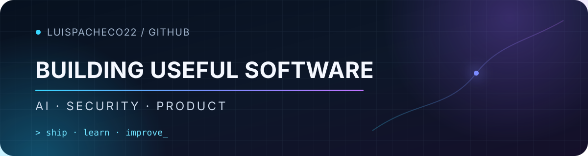

  

  <strong>I build practical AI systems, secure cloud products, and developer tools.</strong> 
  Turning complex workflows into useful software—and learning from every release.

## What I'm building

<table>
  <tr>
    <td width="50%" valign="top">
      <h3>🤝 <a href="https://apoyito.me">Apoyito ↗</a></h3>
      
Connecting reviewed cases in Peru with people who want to help through direct Yape, Plin, or bank-transfer support.

      
<code>Direct support</code> <code>Trust &amp; transparency</code> <code>Peru</code>

    </td>
    <td width="50%" valign="top">
      <h3>🛡️ <a href="https://redlampsecurity.com/en">Red Lamp Security ↗</a></h3>
      
Authorized web, API, and AI-native security assessments, source-code review, and cloud security—built around clear scope, reproducible evidence, and human validation.

      
<code>AppSec</code> <code>AI security</code> <code>AWS · GCP · Azure</code>

    </td>
  </tr>
  <tr>
    <td width="50%" valign="top">
      <h3>🎙️ Sales AI Management</h3>
      
Building voice-agent and scoring systems, together with the Supabase, Railway, Google Cloud, and DevSecOps foundations that keep them dependable.

      
<code>Voice AI</code> <code>Scoring</code> <code>Cloud delivery</code>

    </td>
    <td width="50%" valign="top">
      <h3>🧩 <a href="https://github.com/luispacheco22/OpenBurp">OpenBurp ↗</a></h3>
      
An open-source workflow connecting Claude Code and Codex with Burp Suite Professional for authorized security testing.

      
<code>Open source</code> <code>Security tooling</code> <code>AI workflows</code>

    </td>
  </tr>
</table>

## Private R&amp;D

**Ultron** — exploring human-supervised agentic security workflows. The repository and implementation details stay private by design.

## Current focus

`Applied AI` · `Voice agents` · `Scoring systems` · `Agentic workflows` · `DevSecOps`

## Toolbox

`TypeScript` · `Python` · `Supabase` · `Railway` · `Google Cloud` · `Docker` · `Burp Suite`

---

  Build quietly. Share what helps. Keep the sensitive parts private.

